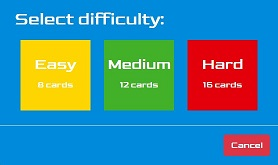
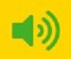

# Milestone Project 2

---

## Lego Memory Game

This project is a summary of study from the fourth and fifth module of the Full Stack Developer Course - JavaScript Fundamentals & Interactive Frontend Development, to build a custom, mobile-first, fully responsive Vanilla JavaScript memory game.

The purpose of the game is to improve memory skills. Players can race against the countdown timer and keep track of their scores to see how well their memory skills are improving. The game is short and mobile-friendly so it's ideal for playing on your commute or for short brain training sessions during the day. This game would be the first in a range of memory games and games for language learning.

## Table of contents

- <a href="#project">Project Construction 👷</a>
- <a href="#ux">User Experience Design 🧠</a>
- <a href="#tech">Technologies Used 🔨</a>
- <a href="#features">Features List 😲</a>

## 1️⃣ Project Construction 👷

This project uses HTML5, CSS3 and Vanilla JavaScript to make the individual features of the game work. The above three programming languages were used in conjunction with the Bootstrap Framework to ensure the project itself is as responsive as possible for use amongst the current everyday screen device sizes such as, Mobile, Tablet and Laptop.

<a href="#top">Back to top ⬆️</a>

## 2️⃣ User Experience Design 🧠

### User stories:
#### Player:
1. As a player, I want to play a game that involves using my memory so that I can improve my memory skills.
- The main purpose of the game is to improve memory skills, player can play the game in the play section.
2. As a player, I want to know how playing memory games can improve memory skills.
- Information about the benefits of playing memory games can be found in the about section.
3. As a player, I want a mobile friendly game to play whilst on the go via my mobile phone/tablet.
- Application is fully responsive thanks to bootstrap framework and mobile first design approach.
4. As a player, I want a game that is intuitive and easy to use so that I can learn how to use it quickly.
- The game is very intuitive to use. As addition player can find how to play info in about section.
5. As a player, I want to see my score so that I can see if I am making progress.
- Users can keep track of their score by watching the timer, turn count and points while they're playing the game, and see their best scores in best score section in the game.
6. As a player, I want a fun game that will attract my kids to play and help with their memory skills.
- Game has a Lego theme so the kids will love to play. It also has difficulty levels so will suit all ages.

#### Developer:
1. As a developer, I want to create memory game using JavaScript.
- JavaScript is the main language that was used to create the game.
2. As a developer, I want to create fully responsive app to showcase my skills to a potential employer.
- Application is fully responsive thanks to bootstrap framework and mobile first design approach.
3. As a developer, I wanted to create a game as gaming has been my primary hobby since being a child.

### Design:
#### Colour Scheme:
4 primary colours are used which are the main Lego colours:
-  #ffd500 used as a background for main menu section.
-  #008adb used as a background for modals and buttons in main menu section.
-  #e3000b used as a background for main play button in main menu section.
-  #43b02a used as a background for cards.

All colours were used to style various elements in application.

#### Typography:
The "Goldman" font is the main font used throughout the whole website with Sans Serif as the fall back font in case the font isn't imported into the site correctly.
The "Roboto Mono" font is the font used in main arena section to prevent "jumping" text while numbers are changing.

Both fonts are attractive and appropriate.

#### Content Structure:
The main game geometry of the game is square, it refers in this way to Lego bricks. The game base on two sections and modals. All modals are square and have blue backgrounds. It is very easy solution to make sure all will be good visible on mobile devices.

#### Images:
The main image in main menu section is Emmet which is well know character from Lego movie. It will focus attention around younger and also older players.

#### Wireframes:
- <a href="assets/readmeimages/desktop-wireframes.pdf" target="_blank">Desktop wireframes</a>
- <a href="assets/readmeimages/mobile-wireframes.pdf" target="_blank">Mobile wireframes</a>

<a href="#top">Back to top ⬆️</a>

## 3️⃣ Technologies Used 🔨

### Languages Used:

- <a href="https://en.wikipedia.org/wiki/HTML" rel="noopener" target="_blank">HTML</a> - Standard mark-up language for documents designed to be displayed in a web browser.
- <a href="https://en.wikipedia.org/wiki/CSS" rel="noopener" target="_blank">CSS</a> - Describes how HTML elements are to be displayed on screen, paper, or in other media.
- <a href="https://en.wikipedia.org/wiki/JavaScript" rel="noopener" target="_blank">JavaScript</a> - Is a programming language that conforms to the ECMAScript specification.

### Frameworks, Libraries & Programs Used:

- <a href="https://getbootstrap.com/" rel="noopener" target="_blank">Bootstrap</a> - Potent front-end framework used to create modern websites and web apps.
- <a href="https://jquery.com/" rel="noopener" target="_blank">jQuery</a> - Fast, small, and feature-rich JavaScript library.
- <a href="https://code.visualstudio.com/" rel="noopener" target="_blank">Visual Studio Code</a> - Free source-code editor made by Microsoft for Windows, Linux and macOS.
- <a href="https://git-scm.com/" rel="noopener" target="_blank">Git</a> - Free and open source distributed version control system.
- <a href="https://github.com/" rel="noopener" target="_blank">GitHub</a> - A Git repository hosting service.
- <a href="https://fontawesome.com/" rel="noopener" target="_blank">Font Awesome</a> - A web font containing all the icons from the Twitter Bootstrap framework, and now many more.
- <a href="https://fonts.google.com/" rel="noopener" target="_blank">Google Fonts</a> - A library of 999 free licensed font families.
- <a href="balsamiq.com" rel="noopener" target="_blank">Balsamiq</a> - Wireframing tool.

<a href="#top">Back to top ⬆️</a>

## 4️⃣ Features List 😲

### Existing features:

#### Main Menu:

This is the first screen presented to the player. There are four main buttons:
- Play - After pressing this button, difficulty level modal pop up. After choosing level the game will start.
  	- Cancel button will dismiss modal.

  

- About - After pressing this button, about modal pop up. Player can check game rules, scoring system and benefits of playing memory games.
  - Close button will dismiss modal.

  

- Highscores - After pressing this button, highscores modal pop up. Player can check scores for each difficulty level, they are sorted by points from high to low. Scores are stored in local storage and best 5 scores for level will be presented. Hover effect will highlight selected row.
  - Clear scores button will clear local storage and delete rows with scores for each level.
  - Close button will dismiss modal.

  

- Credits - After pressing this button, credits modal pop up. Player can check who developed game and find contact information. There is also credits section with special thanks.
  - Close button will dismiss modal.

!!!!!!!!!!!!!!!!!!!!!!!!!!!!!!!!!!!!!!!!

- Volume - Pressing this button will toggle on/off audio in the application.

   Audio ON &nbsp;&nbsp;&nbsp;
   Audio OFF

<a href="#top">Back to top ⬆️</a>

## 5️⃣ Testing 🔥

<a href="#top">Back to top ⬆️</a>

## 6️⃣ Deployment 🚀

This project was developed in Visual Studio Code editor. All developments were pushed to the corresponding repository in GitHub account.

In order to deploy the website to GitHub pages, I:

- Selected the Repository from the GitHub Dashboard.

- Navigated to "Settings" then "GitHub Pages".

- Selected "master branch" in Source section.

- Page auto refreshed and link generated under GitHub Pages section:

  👉 Your site is published at https://zokam1411.github.io/milestone-project-1/

### To run this project locally:

- Select the Repository from the GitHub Dashboard.

- Click the green button labelled 'Code'.

- Click 'Download ZIP'.

- Extract ZIP file on your computer.

- Open folder and open index.html in web browser.

### To clone this project:

- Select the Repository from the GitHub Dashboard.

- Click the green button labelled 'Code'.

- To clone the repository using:
    - HTTPS: under "Clone with HTTPS", click checklist icon.
    - SSH: click Use SSH, then click checklist icon.

- Open Git Bash.

- Change the current working directory to the location where you want the cloned directory.

- Type 'git clone', and then paste the URL you copied earlier.

- Press Enter to create your local clone.

<a href="#top">Back to top ⬆️</a>

